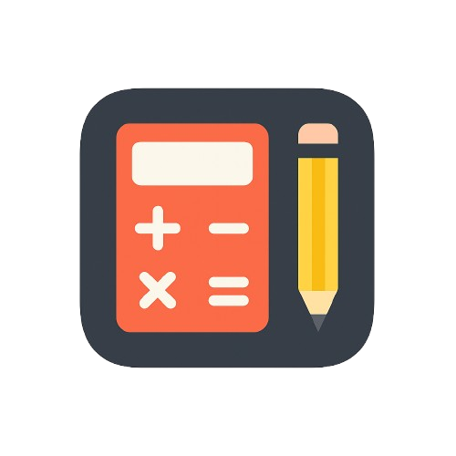

# 🎯 Gradely

[](https://opensource.org/licenses/MIT)
[](https://reactjs.org/)
[](https://fastapi.tiangolo.com/)
[](https://www.postgresql.org/)
[](https://tailwindcss.com/)

<p align="center">
  
</p>

---

## 👋 About the Project

**Gradely** is a full-stack web application that replaces spreadsheets with an interactive, student-friendly dashboard for tracking grades, forecasting final outcomes, and testing academic scenarios.

Built by a student, for students, it's a smarter way to stay in control of your academic goals.

---

## ✨ Key Features

### ✅ Core Features (MVP)
- 📘 **Course Creation**: Add multiple courses with term info
- 📝 **Assessment Input**: Log assignments, quizzes, exams, and labs with custom weights
- 📊 **Live Grade Breakdown**: Dynamic grade calculation based on completed work
- 🎯 **Goal Simulation**: Set a target grade and get insight into what you need to reach it
- 🔮 **Scenario Testing**: Simulate what-if grades for individual assessments

### 🚀 Stretch Goals
- 📥 **Export** course summaries as PDF or CSV
- 📆 **Calendar Integration** for assignment due dates
- 📈 **GPA Calculator** for term or cumulative tracking
- ☁️ **Cloud Hosting** via AWS (S3, Lambda, RDS, etc.)
- 🧠 **Syllabus OCR Parser** using AWS Textract to auto-fill assessments

---

## 🛠️ Tech Stack

### Frontend
- **React.js** (v18+)
- **TailwindCSS**
- **ShadCN**

### Backend
- **Python** with **FastAPI**
- **PostgreSQL** 
- **Auth**: JWT-based, with OAuth2 support planned

### Parsing / AI (Planned)
- **OCR**: AWS Textract / Python Tesseract
- **Parsing**: Regex + ML for syllabus extraction

---

## 🧪 Feature Flow Example: Scenario Calculator

Let’s say you’ve completed 70% of your course with an average of 85%, and you're aiming for a 90% final grade.
Gradely shows you exactly what mark you need on your remaining evaluations to reach your goal,
no spreadsheets, no guesswork, just clean visuals and accurate math.

## 🚀 How to Run (Dev)

### Prerequisites
- Node.js + npm
- Python 3.11+
- PostgreSQL

### Setup

```bash
git clone https://github.com/your-username/gradetracker.git
cd gradetracker

# Backend
cd backend
python -m venv venv
source venv/bin/activate
pip install -r requirements.txt
uvicorn main:app --reload

# Frontend
cd ../frontend
npm install
npm run dev
